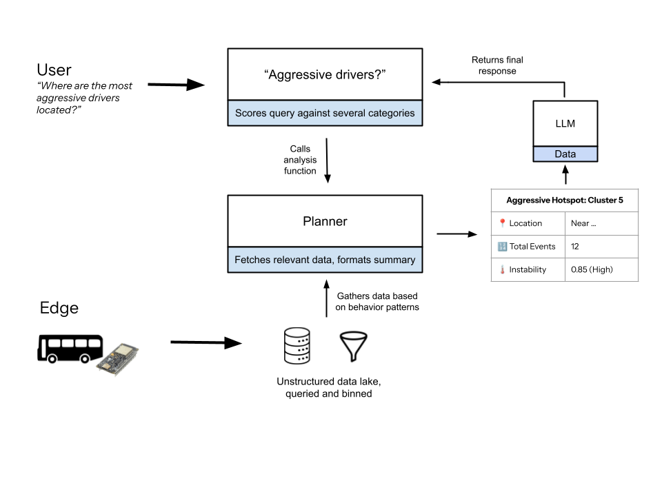

# Sting Sense - Multi-Layered Context Injection for Bus Analytics

A sophisticated transportation analytics system that transforms raw bus telemetry into actionable insights through intelligent data processing and LLM-powered synthesis.

**[Dashboard](https://sting-sense-map.vercel.app/)** | **[GitHub Repository](https://github.com/kpath1999/sting-sense-map)**

---

## System Architecture Overview

The system employs a **multi-layered context injection strategy** that progressively enriches raw sensor data with semantic meaning before presenting it to users. This architecture ensures that Large Language Models (LLMs) receive pre-processed, context-rich summaries rather than raw data, enabling more accurate and actionable responses.



### Data Flow Pipeline

1. **Edge Data Collection**: Buses equipped with sensors collect raw telemetry (GPS coordinates, timestamps, speed, acceleration)
2. **Data Lake & Preprocessing**: Raw data flows into an unstructured data lake where a query engine performs behavior-based binning using instability scores
3. **Planner & Context-Rich Summarization**: The core intelligence layer interprets user queries and generates structured, context-aware summaries
4. **LLM-Powered Synthesis**: Pre-processed summaries are injected into prompts, allowing the LLM to synthesize coherent, human-readable responses

---

## The Planner: Core Intelligence Layer

The Planner is the system's orchestration engine, comprising analytical and data-handling functions that transform raw telemetry into actionable insights.

### Cluster Mode Analysis

When users query aggregated patterns, the system leverages these specialized analysis functions:

#### `computeAggressiveHotspots()`
Identifies dangerous driving behaviors through multi-stage processing:
- **Filtering**: Isolates events classified as `Aggressive` or `Very Aggressive`
- **Clustering**: Groups events by `clusterId` property
- **Aggregation**: Calculates total events and average instability score per cluster
- **Contextualization**: Enriches each cluster with human-readable location descriptions via `getEnhancedLocationContext()`
- **Prioritization**: Sorts clusters using a weighted score (`averageInstability × eventCount`) and returns top 5 hotspots

**Output Example**:
```
Cluster 5 at Klaus Advanced Computing Building (12 events, average instability 0.85)
```

#### `computeDwellIndicators()`
Detects significant pauses in bus journeys (dwell time analysis):
- **Temporal Gap Detection**: Identifies consecutive data points with ≥2 minute gaps (≥120,000ms)
- **Event Classification**: Tags each dwell event with duration, post-dwell behavior, location, and timestamp
- **Context Enrichment**: Generates human-readable location descriptions for each stop

**Use Case**: Identifying bottlenecks, passenger loading delays, or traffic congestion points

#### `computeRouteEfficiency()`
Assesses route directness and efficiency:
- **Distance Calculation**: Sums incremental distances between consecutive GPS points using Haversine formula
- **Efficiency Ratio**: Compares straight-line distance to actual traveled distance
- **Interpretation**: Ratio near 1.0 indicates direct routing; lower values suggest circuitous paths

**Formula**: `Efficiency = Straight-line Distance / Traveled Distance`

---

## User Intent & Data Orchestration

### Query Understanding Pipeline

#### `analyzeUserQuery()`
**Intent Classification Engine** - First stage of query processing:
- **Normalization**: Converts query to lowercase
- **Keyword Scoring**: Matches against predefined categories:
  - `aggressivePatterns`: ['aggressive', 'dangerous', 'speeding', 'harsh', 'reckless', 'behavior', 'pattern']
  - `dwellTime`: ['dwell', 'stop', 'wait', 'idle', 'stationary', 'linger', 'pause']
  - `routeEfficiency`: ['route', 'path', 'efficiency', 'detour', 'time', 'distance', 'slow', 'fast']
  - `generalInfo`: ['summary', 'overview', 'information', 'stats', 'insight', 'analysis']
- **Category Selection**: Returns highest-scoring category; defaults to `generalInfo` if no matches

#### `fetchRelevantData()`
**Central Dispatcher** - Routes queries to appropriate analysis functions:
- Invokes category-specific functions based on intent (e.g., `computeAggressiveHotspots()` for `aggressivePatterns`)
- Gathers base statistics (total events, time range, behavior distribution)
- Bundles results into structured object for downstream processing

#### `formatSummaryForPrompt()`
**Context Card Generator** - Final preparation before LLM injection:
- Converts structured data objects into human-readable text blocks
- Generates numbered lists with location context and metrics
- Example transformation:
  ```
  Hotspot Object → "1. Cluster 5 at Klaus Advanced Computing Building (12 events, average instability 0.85)"
  ```

---

## Raw Data Processing Mode

For users requiring direct data access, the system provides an optimized raw data pipeline:

#### `processRawMode()`
**Raw Data Orchestrator** - Manages unfiltered telemetry analysis:
- **Size Check**: Tests if full dataset fits in single API call (~98,000 tokens)
- **Single-Chunk Path**: Sends entire compressed dataset in one request if within limits
- **Multi-Chunk Path**: 
  - Calls `splitFeaturesForRawMode()` to partition data
  - Sends chunks sequentially to LLM for incremental analysis
  - Synthesizes chunk notes into cohesive final response
- **Compression**: Uses `compressDataset()` to reduce payload size by ~60%

#### `splitFeaturesForRawMode()`
**Token-Based Chunking Engine** - Intelligent data partitioning:
- **Optimization**: Compresses features using abbreviated keys (`b`, `t`, `c`, `i`, `cl`, `a`)
- **Token Estimation**: Calculates payload size using `TOKENS_PER_CHAR_ESTIMATE = 0.25`
- **Dynamic Splitting**: Calculates optimal features per chunk based on `MAX_INPUT_TOKENS = 98,000`
- **Safety Limits**: Maximum 20 chunks with truncation warnings

**Efficiency Gain**: Processes ~35x more data per request compared to legacy character-based chunking

#### `compressDataset()`
**Data Compression Utility** - Optimizes telemetry for transmission:
- **Property Selection**: Extracts only essential fields (behavior, timestamp, coordinates, instability, acceleration percentiles)
- **Key Abbreviation**: Maps verbose property names to single characters:
  - `b`: behavior
  - `t`: timestamp
  - `c`: coordinates [lat, lon]
  - `i`: instability_score
  - `cl`: cluster
  - `a.m`: accel_mean
  - `a.x99/y99/z99`: accel_stats_{axis}_p99
- **Legend Inclusion**: Embeds property name legend for LLM interpretation

---

## Individual Event Context Enrichment

These functions inject layers of semantic context into raw GPS coordinates and timestamps:

#### `getEnhancedLocationContext(lat, lon)`
**Landmark Resolution System** - Translates coordinates to meaningful places:
- **Landmark Database**: Checks against `campusLandmarks` (buildings, intersections, transit stops, construction zones)
- **Proximity Matching**: Finds all landmarks within specified radii
- **Context Layering**: Generates descriptions like:
  ```
  "near Klaus Advanced Computing Building, close to Guggenheim Building (construction zone nearby)"
  ```

#### `getTemporalContext(timestamp)`
**Time-Aware Context Generator** - Infers real-world conditions:
- **Time-of-Day Classification**: Maps hour to campus activity patterns
  - 7-9 AM: "morning rush hour" → "heavy commuter traffic" → "students heading to early classes"
  - 11 AM-1 PM: "lunch hours" → "food delivery vehicles" → "high pedestrian activity"
- **Academic Calendar Awareness**: Distinguishes weekdays, weekends, academic year vs. summer

#### `getEnhancedNeighborAnalysis(lat, lon, radius=100)`
**Spatial Pattern Detector** - Analyzes local event clusters:
- **Proximity Filter**: Finds events within 100m radius
- **Behavior Distribution**: Calculates local event type frequencies
- **Pattern Classification**: Determines if event is isolated or part of local cluster

**Output Example**:
```
"The immediate area contains 3 other events: 2 Calm, 1 Aggressive"
```

#### `getCampusFeatureContext(locationContext, temporalContext)`
**Cross-Reference Synthesizer** - Combines multiple context layers:
- **Location-Time Inference**: Maps scenarios like:
  - Academic building + weekday 8-5 PM → "High student pedestrian traffic between classes"
  - Transit stop + rush hour → "Bus and trolley traffic with passenger loading/unloading"
  - Dining area + meal times → "Food delivery vehicles and student meal traffic"

---

## LLM Integration Strategy

### Prompt Engineering

The system uses **templated prompts** with dynamic context injection:

```javascript
aggressivePatterns: `You are a transportation safety analyst. Given the following summary 
of aggressive driving evidence, explain the underlying patterns in plain language, cite 
the campus locations, and recommend one follow-up analysis. Reply in plain text with no 
markdown, bullets, headings, or special characters.

DATA SUMMARY:
{{data}}

USER QUESTION: {{userQuery}}`
```

**Key Principles**:
- LLM receives pre-processed summaries, not raw data
- Context cards replace voluminous telemetry
- Plain text output constraints prevent formatting artifacts
- Role-based prompts guide analytical focus

### Optimization Parameters

**Token Management** (Llama 4 Scout 17B):
- `MAX_CONTEXT_TOKENS = 100,000` (conservative estimate, actual ~131K)
- `MAX_INPUT_TOKENS = 98,000` (reserves 2,000 for output)
- `max_tokens = 1000` (summary endpoint)
- `max_tokens = 200` (insight endpoint)

**Data Compression**:
- Abbreviated JSON keys reduce payload by ~60%
- Legend included for LLM interpretation
- Selective property inclusion based on query intent

---

## System Capabilities

### Dual Analysis Modes

**Cluster Mode** (Default):
- Pre-aggregated insights from behavior-based clustering
- Faster responses with structured summaries
- Optimized for pattern discovery and high-level analysis

**Raw Mode** (Advanced):
- Direct access to unfiltered telemetry
- Token-optimized chunking for large datasets
- Enables granular, timestamp-level analysis

### Query-Driven Intelligence

The system adapts analysis strategy based on natural language queries:
- "Where are the most aggressive drivers?" → `computeAggressiveHotspots()`
- "How long does the bus wait at stops?" → `computeDwellIndicators()`
- "Is this route efficient?" → `computeRouteEfficiency()`

---

## Technical Implementation

**Frontend**: Leaflet.js for map visualization, vanilla JavaScript for UI/logic  
**Backend**: Express.js serverless functions via Vercel  
**LLM Provider**: Groq API (Llama 4 Scout 17B)  
**Data Format**: GeoJSON with enriched properties (behavior classification, instability scores, acceleration percentiles)

**Key Files**:
- `public/index.html`: Core analysis logic, context injection pipeline
- `server.js`: API endpoints, LLM integration
- `bus_route_with_clusters.geojson`: Pre-processed telemetry with behavior labels

---

## Experimental Validation Framework

### Comparative Analysis: Cluster vs. Raw Mode

**Representative Queries**:
1. "Where are the most aggressive drivers located?"
2. "How long does the bus stop at each location?"
3. "Is the route efficient or are there unnecessary detours?"
4. "What patterns emerge during morning rush hour?"
5. "Identify any safety concerns along the route"
6. "Compare driving behavior near academic buildings vs. transit stops"
7. "Which time periods show the most unstable driving?"
8. "Summarize the overall trip characteristics"

**Expected Deltas**:
- **Cluster Mode**: Higher-level patterns, faster responses, location-aggregated insights
- **Raw Mode**: Granular timestamp details, individual event analysis, comprehensive data coverage

**Evaluation Metrics**:
- **Precision/Recall**: Against manually verified ground truth incidents
- **Response Length**: Token count and readability
- **Analyst Effort**: Time required to extract actionable insights
- **Latency**: End-to-end query response time
- **Coverage**: Percentage of dataset processed (especially relevant for raw mode)

### GPS-to-Landmark Coverage Analysis

**Coverage Quantification**:
- % of GPS points mapped to landmarks (within radius)
- % near-miss (within X meters but outside radius)
- % unmapped (no landmarks within reasonable distance)

**Landmark Database Completeness**:
- Current coverage: 15 buildings, 6 intersections, 6 zones, 6 transit stops, 4 crosswalks, 2 construction zones
- Future enhancements: Polygon-based zones for precise geometric boundaries

### Ground Truth Definition

**Verification Sources**:
- Manual review of video footage (if available)
- Bus operator incident reports
- Campus security logs
- Cross-validation with other sensor modalities

**Scoring Rubric**:
- **Correct**: LLM response matches verified incident details (location, time, behavior type)
- **Partially Correct**: Correct behavior type but imprecise location/time, or vice versa
- **Incorrect**: Contradicts ground truth or hallucinates non-existent events

---

## Future Enhancements

- **Polygon-based zones**: Replace radius-based landmark matching with precise geometric boundaries
- **Real-time streaming**: Support live telemetry analysis via Server-Sent Events (SSE)
- **Multi-route comparison**: Cross-route pattern analysis and benchmarking
- **Predictive modeling**: Forecast high-risk zones based on historical patterns
- **Ground truth validation pipeline**: Automated scoring against verified incident databases
- **Multi-modal context**: Integrate weather data, traffic patterns, and campus event calendars
